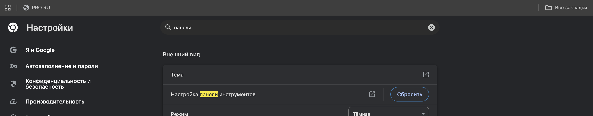
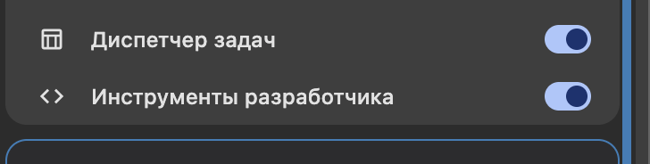
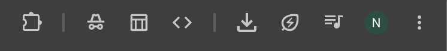
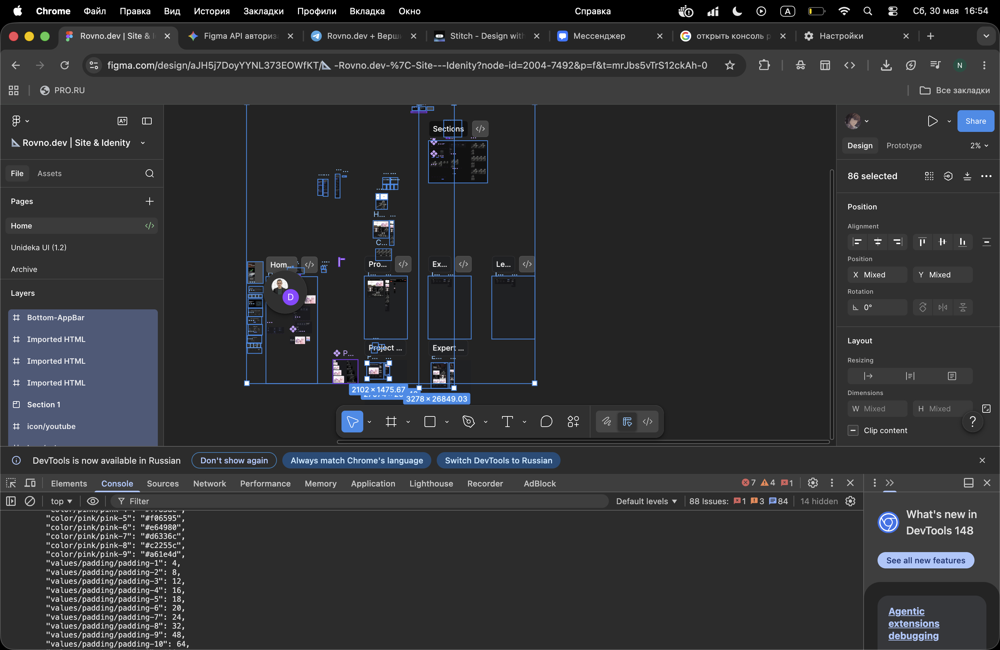
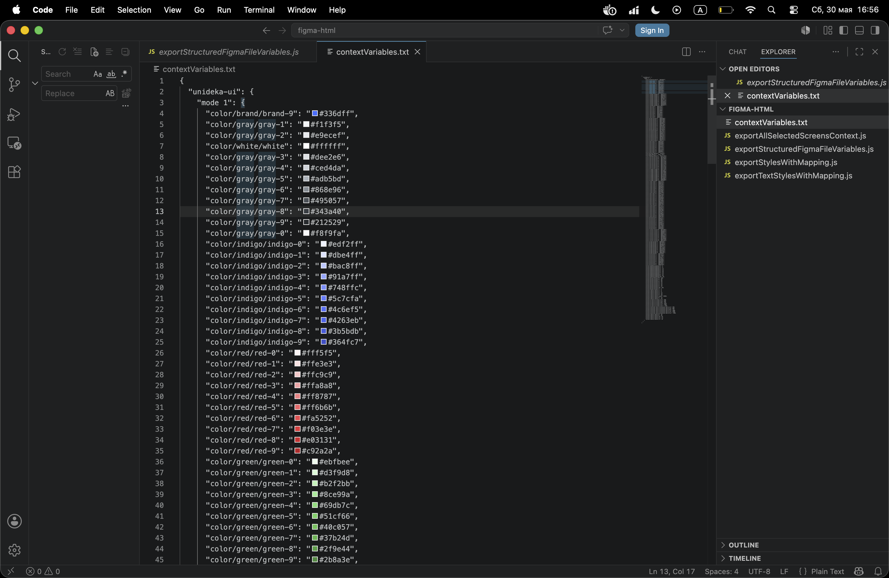
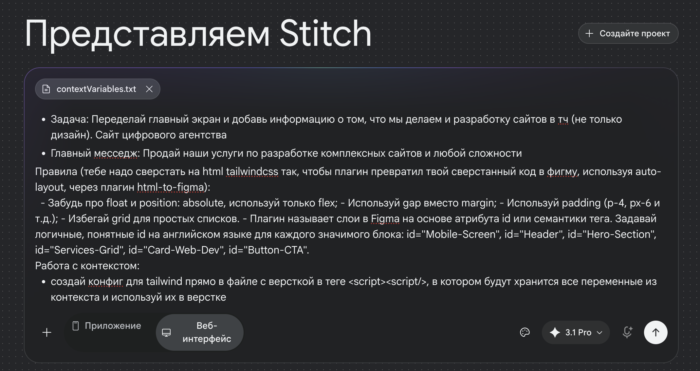
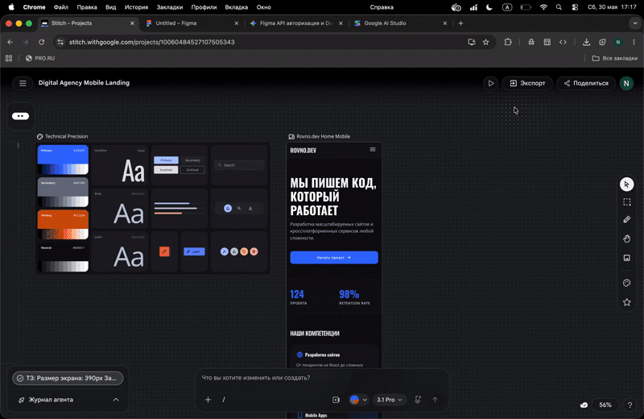
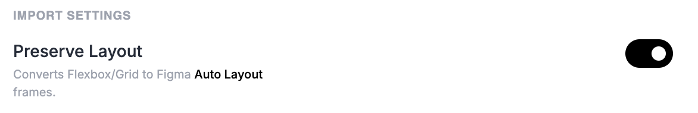

### exportVariables — "Словарь всех констант"

**Что делает:** Берет все твои коллекции переменных и собирает их в дерево: Коллекция -> Режим (Light/Dark) -> Имя переменной -> Значение.

**Зачем:** Чтобы ИИ знал, что «цвет фона в темной теме — это `#09090b`», а не просто «какой-то серый».

### exportStyles — "Таблица связей цветов"

**Что делает:** Проверяет каждый твой стиль и говорит: «Этот стиль — это вот такая переменная из первого скрипта» или «Этот стиль — это просто чистый HEX-код».

**Зачем:** Чтобы ИИ понимал, какие именно стили в Фигме соответствуют твоим переменным.

### exportTextStyles — "CSS-инструкция для текста"

**Что делает:** Берет параметры шрифта (размер, жирность, высоту строки) и превращает их в готовый CSS-объект: font-size, line-height и т.д.

**Зачем:** Чтобы ИИ просто взял этот JSON и написал CSS/Tailwind-код, где текст будет выглядеть ровно так же, как в твоем макете, без догадок.

### exportSelectedContext - "Полностью собирает весь дизайн в json"

У кого не открывается консоль разраба в figma web (chrome):



листаем вниз и включаем:





Выделяем весь документ `ctrl + A` или через курсор как удобно, вставляем код в консоль разраба и получаем переменные:





Т.е запускаем по порядку и все копируем к себе в txt файл, чтобы его скормить нейронке.

`exportVariables.js`, `exportStyles.js`, `exportTextStyles.js`, `exportSelectedContext.js`

### все, дальше к нейронке
https://stitch.withgoogle.com/ 

импортируем файл со всеми стилями, куда мы закинули весь наш контекст. В чат нейронке вставляем промпт (размер экрана, задачу, главный месседж под свои задачи пишете, в промпте для примера чисто):

```markdown
## ТЗ:

- Размер экрана: 390px
- Задача: Переделай главный экран и добавь информацию о том, что мы делаем и разработку сайтов в тч (не только дизайн). Сайт цифрового агентства 
- Главный месседж: Продай наши услуги по разработке комплексных сайтов и любой сложности 

### Правила (тебе надо сверстать на html tailwindcss так, чтобы плагин превратил твой сверстанный код в фигму, используя auto-layout, через плагин html-to-figma):  

- Забудь про float и position: absolute, используй только flex;
- Используй gap вместо margin;  
- Используй padding (p-4, px-6 и т.д.);  
- Избегай grid для простых списков.
- Плагин называет слои в Figma на основе атрибута `id` или семантики тега. Задавай логичные, понятные `id` на английском языке для каждого значимого блока: id="Mobile-Screen", id="Header", id="Hero-Section", id="Services-Grid", id="Card-Web-Dev", id="Button-CTA".

### Работа с контекстом:

- создай конфиг для tailwind прямо в файле с версткой в теге `<script><script/>`, в котором будут хранится все переменные из контекста и используй их в верстке
```



Желательно еще pro версию модели выбрать. Можно то же самое сделать в другой нейронке, например, https://aistudio.google.com/

Как экспортировать из stich в figma:




### Как импортировать html + tailwind в figma с auto-layout

https://aistudio.google.com/
вставляем тот же промпт и контекст


!!ОБЯЗАТЕЛЬНО в options в плагине нажимаем на свитч preserver layout


Ссылка на плагин: https://www.figma.com/community/plugin/1595718080286284682


затем вставляем в фигму


ссылка на то что нейронка сверстала
https://www.figma.com/design/c6xP7CkybNKAQi5GM1RJKR/Untitled?node-id=56-6&t=862t4U43WUo7HT8d-1
